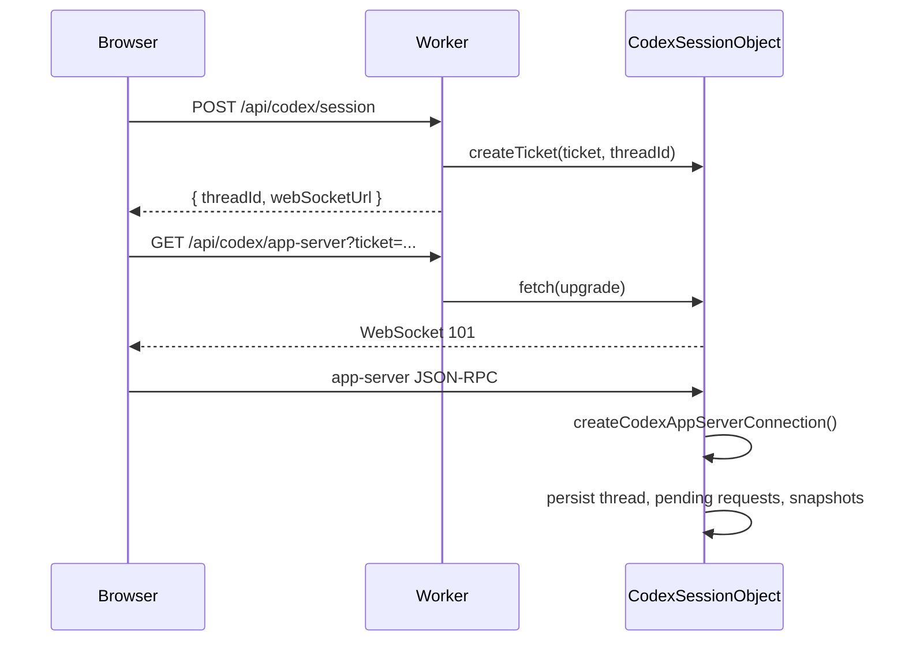

# codex-js Cloudflare Example

Deployable Vite React + Cloudflare Worker + Durable Object example for `@jrkropp/codex-js`.

The browser never receives an OpenAI API key. It creates a Codex session through the Worker, receives a short-lived one-time WebSocket ticket, and then connects to a Durable Object app-server session.

## Architecture



## Install

From the repository root:

```sh
pnpm install
```

For deployed Workers, set the secret with Wrangler:

```sh
pnpm --filter @jrkropp/codex-js-cloudflare-example exec wrangler secret put OPENAI_API_KEY
```

For local development, create `examples/cloudflare/.dev.vars`:

```env
OPENAI_API_KEY=sk-...
```

`wrangler.jsonc` declares `OPENAI_API_KEY` in `secrets.required`. Wrangler uses that declaration for type generation and deploy validation. The Cloudflare Vite plugin may copy `.dev.vars` into `dist` for `vite preview`; Cloudflare documents that this file is for local preview only and is not deployed with the Worker. Do not commit `.dev.vars` or build output.

## Run

```sh
pnpm dev:cloudflare-example
```

## Deploy Dry Run

```sh
pnpm --filter @jrkropp/codex-js-cloudflare-example cf:types:check
pnpm --filter @jrkropp/codex-js-cloudflare-example deploy:dry-run
```

## Routes

- `POST /api/codex/session`: creates a session id, thread id, and one-time WebSocket ticket.
- `GET /api/codex/app-server?ticket=...`: validates and consumes the ticket, then upgrades to a Durable Object WebSocket.

Static assets are served by Workers assets with SPA fallback. Worker-first routing is limited to `/api/*`.

## Durable Object Responsibilities

`CodexSessionObject` owns:

- one app-server runtime per Durable Object instance
- one app-server connection per WebSocket
- Durable Object SQLite thread storage
- pending app-server request storage
- one-time WebSocket ticket validation
- connection session snapshots for hibernation restore
- server-side dynamic tool registration

It uses `ctx.acceptWebSocket(server)` and stores a small socket attachment so the Durable Object can reconstruct the app-server connection after hibernation. Larger connection state is stored in SQLite.

## Dynamic Tools

The example registers two tools in `src/worker/tools.ts`:

- `lookup_deployment`: visible server-executed tool.
- `billing/lookup_invoice`: deferred namespaced server-executed tool.

Application tools belong in the Worker or Durable Object, not in the browser. Tools that omit `execute` are still valid escape hatches; they surface as app-server requests for a client to resolve.
